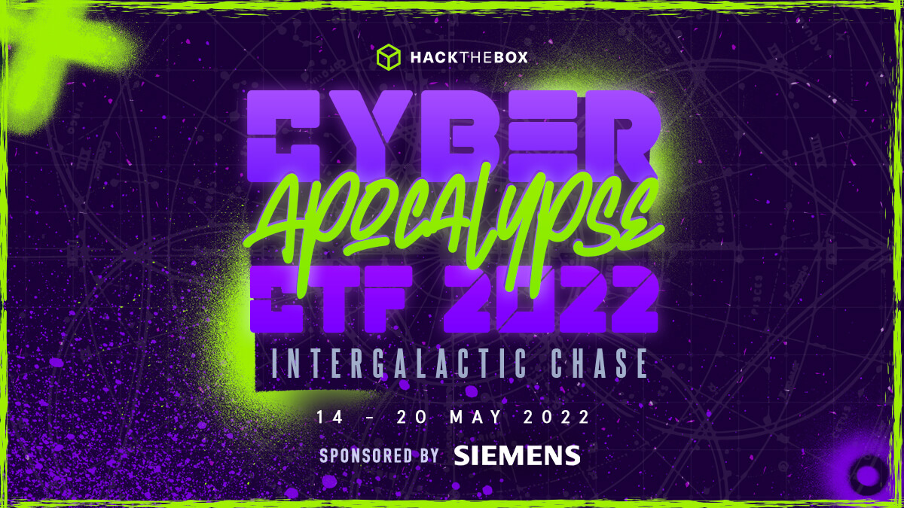
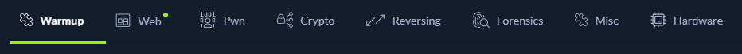

# Cyber Apocalypse CTF 2022 - Intergalactic Chase

## Description

> A super villain named Draeger escaped from a maximum security prison, formed his own evil squad, and convinced the Intergalactic Federal Government to work for him! You are a group of misfits that came together under unlikely circumstances, each with their own hacking "superpowers" and past with Draeger...
> 
> Get ready to travel the universe on your spaceship in pursuit of proving Draeger is a criminal and getting answers for your personal stories.

The CTF had challenges in the following categories:

## Summmary

I had very limited time to play this CTF, but I was able to solve 6 out of 61 challenges. I solved challenges in the categories; `Web`, `Pwn` and `Reversing`.

I have been trying to improve my binary explotation skills lately, so the `Pwn` challenges was fun for this CTF. The `Web` challenges were also good, because I got to do a few techniques that I haven't used much before.

## Writeups

My writeups for the CTF:

- Web
  - [Kryptos Support](./web/kryptos-support/)
  - [BlinkerFluids](./web/blinker-fluids/)
- Pwn
  - [Space Pirate: Entrypoint](./pwn/space-pirate-entrypoint/)
  - [Space pirate: Going Deeper](./pwn/space-pirate-going-deeper/)
- Reversing
  - [WIDE](./reversing/wide/)
